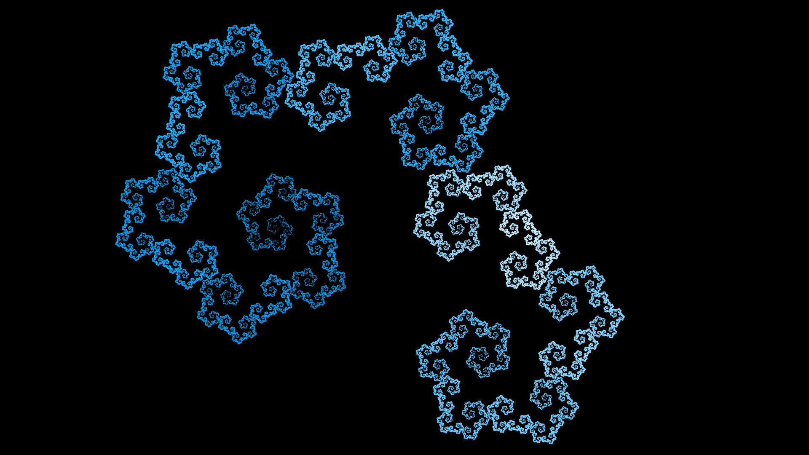

# hata-map

Hata-map simulator

Try it -> https://monman53.github.io/hata-map/

## Screenshots





## Development

```sh
# Initial setup
npm install

# Launch development server
npm run dev

# Build
npm run build
```
